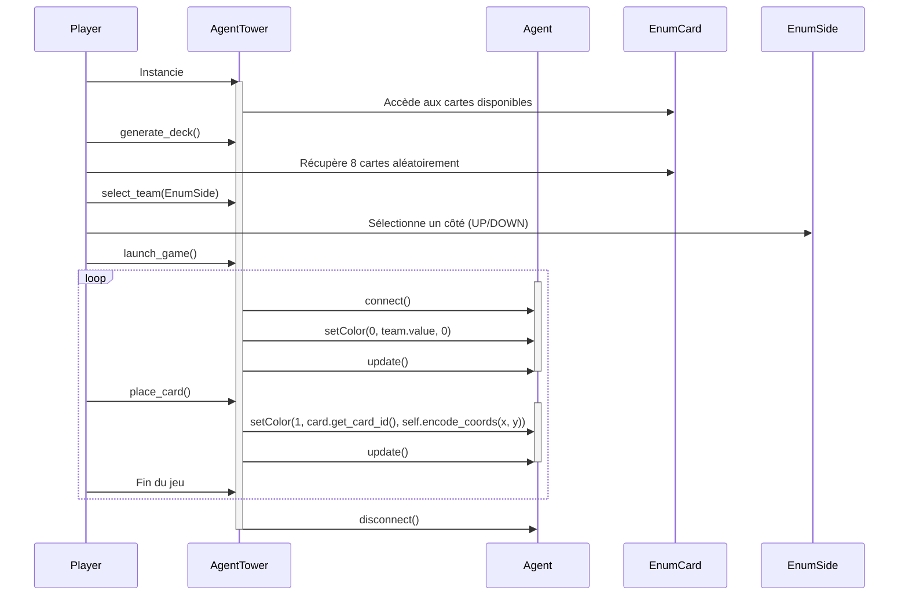
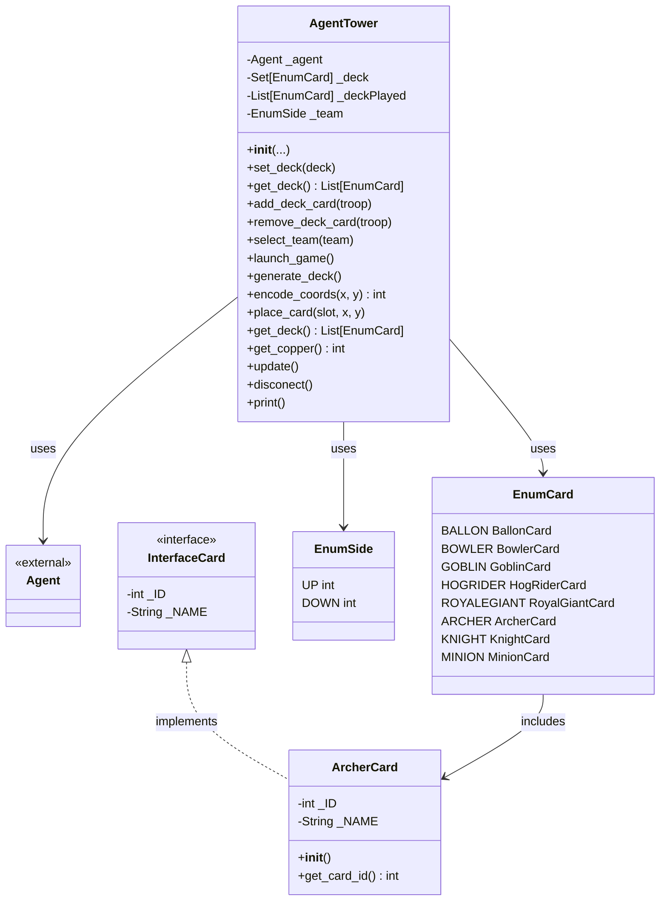
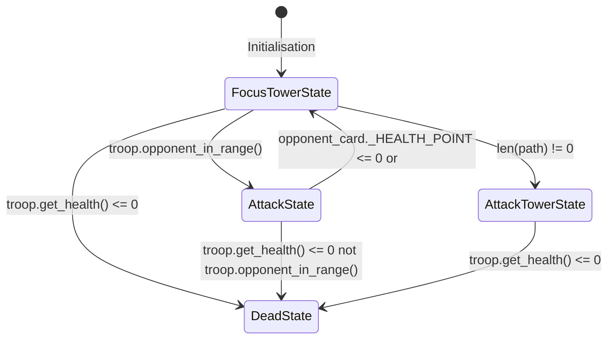

- **Titre** ConflictTowers
- **Description** Jeu de défense de tour en 1vs1, utilisez vos cartes pour se défendre ou attaquer.
- **🎯 Cahier des charges** :
    - **Contexte :**\
    Dans le cadre de notre formation de 3ème année de BUT Informatique, il nous a été demandé de programmer un jeu vidéo 2D en Python, en se basant sur un moteur de jeu léger développé par un enseignant. Dans notre équipe de 3 étudiants, nous avons décidé de faire une sorte de Clash Royal, un jeu où s'affronte 2 joueurs, qui possèdent chacun des cartes de jeu à placer sur un terrain, et qui doivent détruire la tour adverse. Chaque seconde, les deux adversaires gagnent de l'éléxir, qui est le composant nécessaire pour faire apparaître des cartes sur le terrain de bataille.\
    - **Fonctionnalités :**\
        **Génération des cartes (`generate_deck`)**
        - **Objectif**: Permettre au joueur de générer une liste de cartes à utiliser pendant la partie.
        - **Description**: Le système doit fournir une fonction pour générer une pioche de cartes composée d'unités.
        - **Contraintes**:
          - Les cartes doivent être sélectionnées de manière aléatoire parmi un ensemble prédéfini.
          - Le deck doit être équilibré avec un nombre approprié d'unités et de sorts.
          - Le joueur doit avoir la possibilité de modifier le deck avant le début de la partie.
        
        **Sélection de l'équipe (`select_team`)**
        - **Objectif**: Assigner au joueur une équipe avant de commencer la partie.
        - **Description**: Le joueur doit choisir entre deux équipes.
        - **Contraintes**:
          - L'équipe doit être choisie avant le début de la partie.
        
        **Placement des cartes (`place_card`)**
        - **Objectif**: Permettre aux joueurs de placer des cartes sur le terrain.
        - **Description**: Les joueurs doivent pouvoir sélectionner une carte de leur deck et la placer sur le champ de bataille.
        - **Contraintes**:
          - Les cartes doivent être placées dans la zone de déploiement du joueur.
          - Le placement d'une carte consomme des éléxirs.
        
        **Mise à jour du jeu (`update`)**
        - **Objectif**: Actualiser l'état du jeu à chaque instant.
        - **Description**: Le système doit régulièrement mettre à jour le jeu pour refléter les actions des joueurs et l'état actuel du champ de bataille.
        - **Contraintes**:
          - L'état du jeu doit être synchronisé entre les joueurs.
          - Les mises à jour doivent inclure la santé des tours et les unités en jeu.
        
        **Gestion de l'éléxir pour poser une carte**
        - **Objectif**: Implémenter un système d'éléxir pour l'utilisation des cartes.

- **🎲 Règles** du jeu : maquette, déroulé d'une partie, conditions de victoire
- **🎮 Use cases**:
    - pour l'administrateur : expliquer ce que peut/doit faire un administrateur qui souhaite lancer/administrer une arène de jeu avec des apprenants
    - pour l'administrateur : changer les statistiques par défaults des troupes
    - pour le joueur : renvoyer vers README API
    - pour le joueur : poser une carte dans son camp du côté gauche ou du côté droit
    - pour le joueur : connaître la position de toutes les entités (alliées et ennemies)
    - pour le joueur : choisir les cartes de combat par défaut (ou laisser par défaut : attribution de cartes aléatoire)
    - pour le joueur : accès à toutes les cartes de son inventaire
    - pour le joueur : accès à sa quantité de points pour poser une carte
- **🖧 Architecture matériel** (optionnel, peut être décrit avec le diagramme de séquence) : schéma overview présentant les machines et protocoles (serveurs, clients, broker) avec texte expliquant le choix des technologies 
- **📞 Diagramme de séquence**: 

- **📞 Diagramme de classes**:

- **Diagramme d'état**:

- **✅ Pré-requis** 
    - Python 3
    - API ConflictTower
    - Editeur de code ou en ligne avec Replit
- **⚙️ Installation** :
    - Paquets nécessaires
        - Turtle
        - python-dotenv
    - Installer l'API depuis le dossier src/api
    - Après, vous pouvez importer la classe AgentTower, et créer votre agent pour jouer
- **🧪 Tests**: 
    - Les tests se trouvent dans le répertoire src/tests.
    - vous pouvez lancer les classes de tests avec la commande :
        - python3 agent.py # avec tests de agent par exemple
- **🛣️ Roadmap**
- **🧑‍💻 Auteurs**
    - Développeur Pytactx API : Julien ARNE
    - Développeurs ConflictTowers :
        - Damien Leroy
        - Thibaud Lebrasseur
        - Gaëtan Langlois
- **⚖️ License** Image de preview (preview.png) générée à l'aide de l'IA DALL-E
