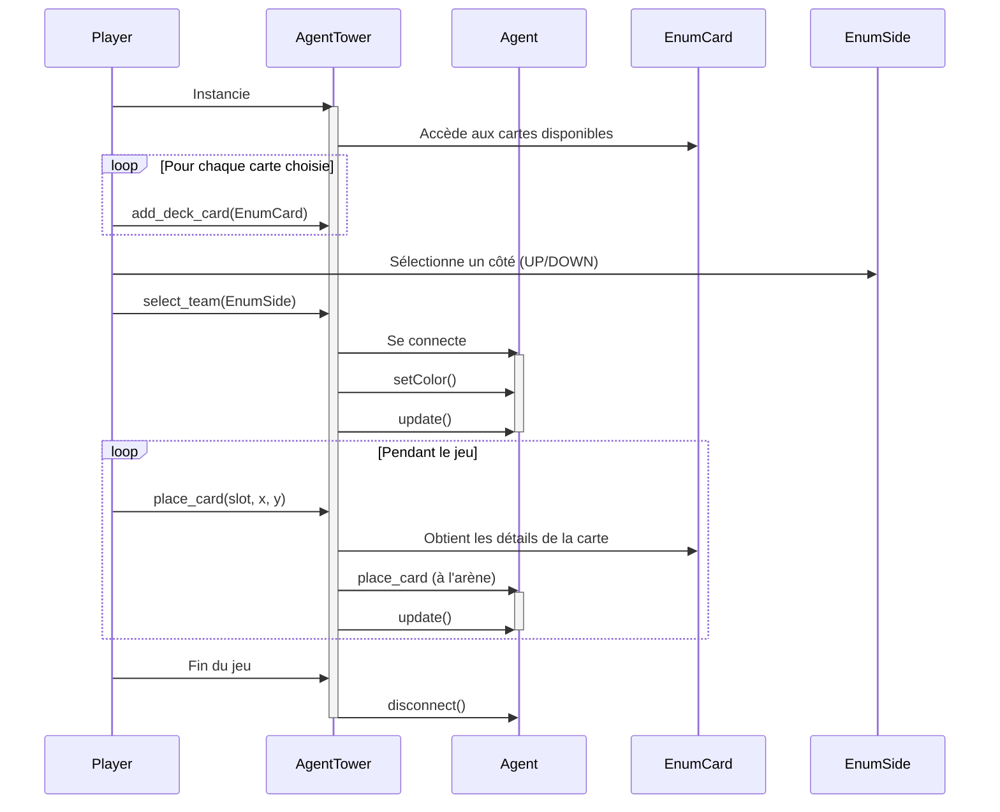
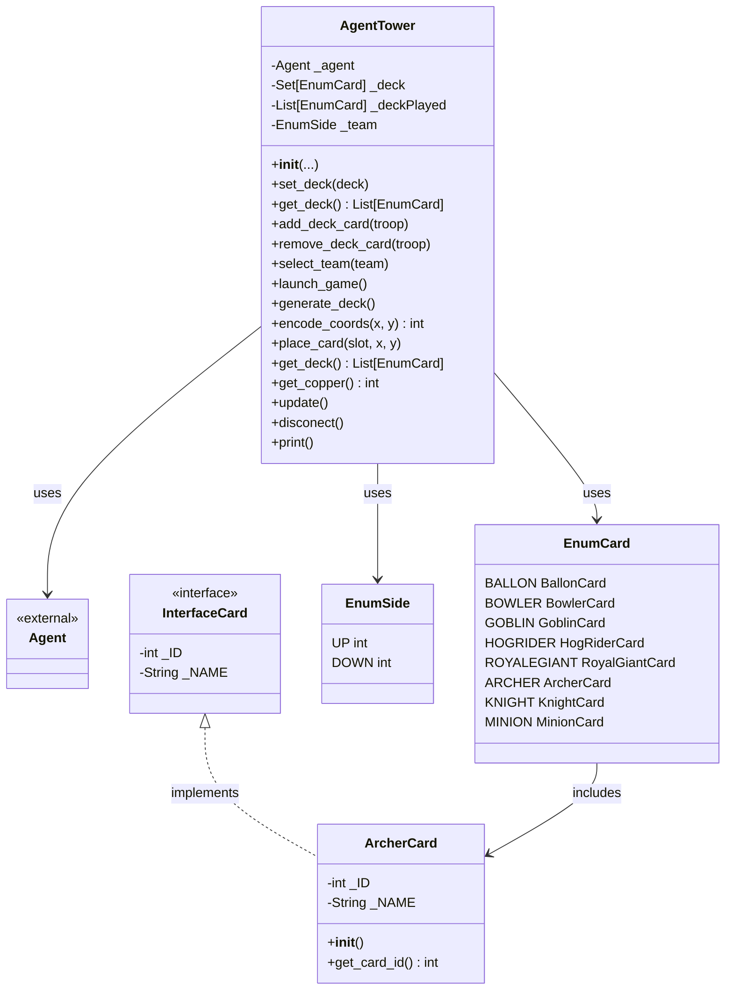

- **Titre** ConflictTowers
- **Description** Jeu de défense de tour en 1vs1, utilisez vos cartes pour se défendre ou attaquer.
- **🎯 Contexte & cahier des charges** : développé dans le cadre d'une formation, pour un formateur pour monter en compétence en Python ...
- **🎲 Règles** du jeu : maquette, déroulé d'une partie, conditions de victoire
- **🎮 Use cases**:
    - pour l'administrateur : expliquer ce que peut/doit faire un administrateur qui souhaite lancer/administrer une arène de jeu avec des apprenants 
    - pour le joueur : renvoyer vers README API
    - pour le joueur : poser une carte dans son camp du côté gauche ou du côté droit
    - pour le joueur : connaître la position de toutes les entités (alliées et ennemies)
    - pour le joueur : choisir les cartes de combat par défaut (ou laisser par défaut : attribution de cartes aléatoire)
    - pour le joueur : accès à toutes les cartes de son inventaire
    - pour le joueur : accès à sa quantité de points pour poser une carte
- **🖧 Architecture matériel** (optionnel, peut être décrit avec le diagramme de séquence) : schéma overview présentant les machines et protocoles (serveurs, clients, broker) avec texte expliquant le choix des technologies 
- **📞 Diagramme de séquence**: 

- **📞 Diagramme de classes**:

- **✅ Pré-requis** 
    - Python 3
    - API ConflictTower
    - Editeur de code ou en ligne avec Replit
- **⚙️ Installation** :
    - Paquets nécessaires
        - Turtle
        - python-dotenv
    - Installer l'API depuis le dossier src/api
    - Après, vous pouvez importer la classe AgentTower, et créer votre agent pour jouer
- **🧪 Tests**: 
    - Les tests se trouvent dans le répertoire src/tests.
    - vous pouvez lancer les classes de tests avec la commande :
        - python3 agent.py # avec tests de agent par exemple
- **🛣️ Roadmap**
- **🧑‍💻 Auteurs**
    - Développeur Pytactx API : Julien ARNE
    - Développeurs ConflictTowers :
        - Damien Leroy
        - Thibaud Lebrasseur
        - Gaëtan Langlois
- **⚖️ License** Image de preview (preview.png) générée à l'aide de l'IA DALL-E
